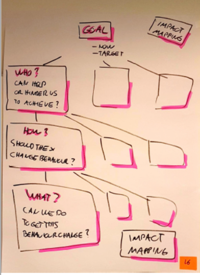

# Impact Mapping

## Syfte
Visa fördelar med att köra planering/prioritering mha Impact Maps jämfört med en rak prioriterad lista med saker
 * Fokus på värdet gör att det är troligare att vi uppnår det
 * Enklare att prioritera om man lyfter det en nivå till vilken beteende förändring vill vi ha
 * Att ta en gren i taget kan ge fokuserade sprintar och därmed fördelarna med fokus, t ex förutsättningar för teamwork, innovation, få mycket gjort mm

## Hur
_Som vi pratade om innan så är fokus i de agila metoderna att få ut maximal “effekt” eller maximalt “värde” för de investerade pengarna. Ofta lyckas vi inte med det…(peka på 64% etc bilden)_

_I Scrum har vi ju en produktbacklog som ska vara till för att fokusera på det mest värdefulla. I praktiken ser man dock att PBLer brukar bli rätt så långa och svåröverskådliga. - Vad är den längsta PBLen ni sett?_

_Det är svårt och arbetskrävande att hålla en så lång PBL ordnad. Dessutom har de oftast features i sig, eller stories, och de brukar vara lite oklart kopplade till effekter._

_Jag ska visa ett bättre alternativ nu, nämligen impact mapping. Där börjar man med fokus på effekten. Gör man det kan man i regel alltid lösa det inom den budget man har!_

Rita de olika nivåerna och berätta. 

_MÅL: Kvantifierat för att minska risken för missförstånd. T ex hur mycket? Hur snabbt?_

_VEM: Vilka intressenter kan hjälpa oss nå målet eller hindra oss från att nå det_

_HUR: Hur ska intressenterna ändra sitt beteende för att hjälpa oss mot målet_

_VAD: Vad kan vi göra för att de ska ändra sitt beteende så som vi vill. Här är vår “backlog nivå”._

Alternativt kör första 10 min i en [video](https://skillsmatter.com/skillscasts/2576-effect-maps) när Gojko gör det och rita bilden medans du lyssnar också.

_Finessen med Impact maps är att det är lättare att prioritera på nivå 3 t ex än på nivå 4. Man får då också fokuserade release/sprintar. Alla vet vad man håller på med varför etc._

_Man slipper prioritera ordning på 1000 ideer i en backlog._

Låt dem öva på: Ett facebook spelföretag vill gå från 500 000 till 1 000 000 aktiva spelare på 6 mån.
När de är klara, dela ut Gojkos lösning och låt dem reflektera bordsvis.
